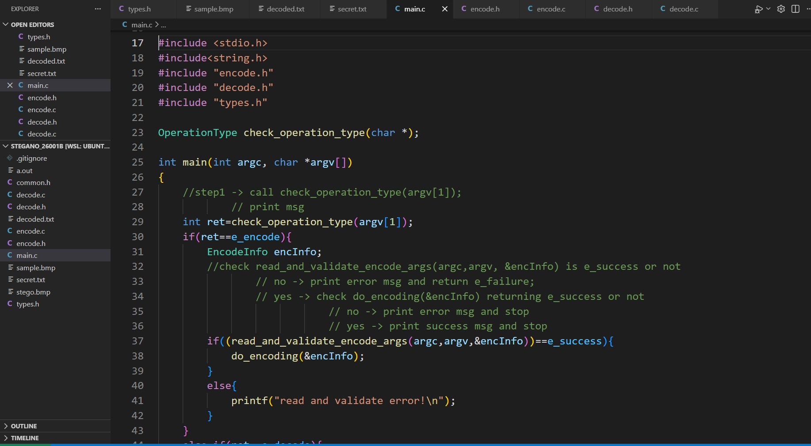
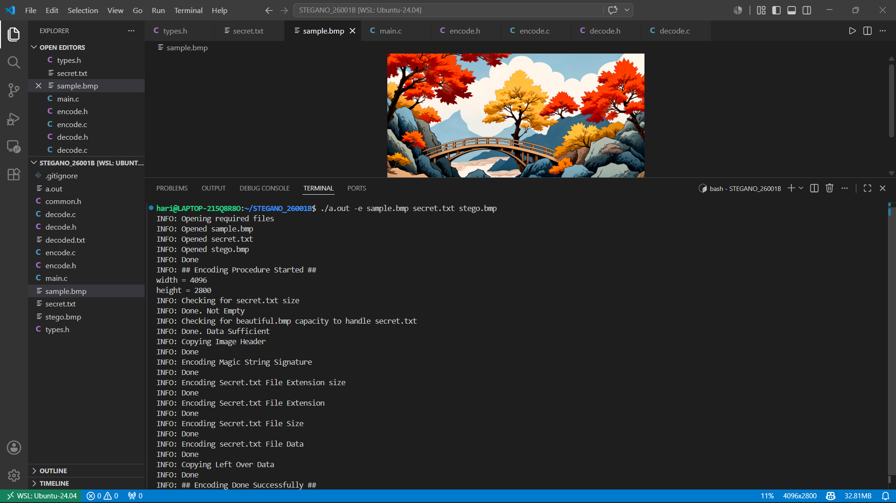
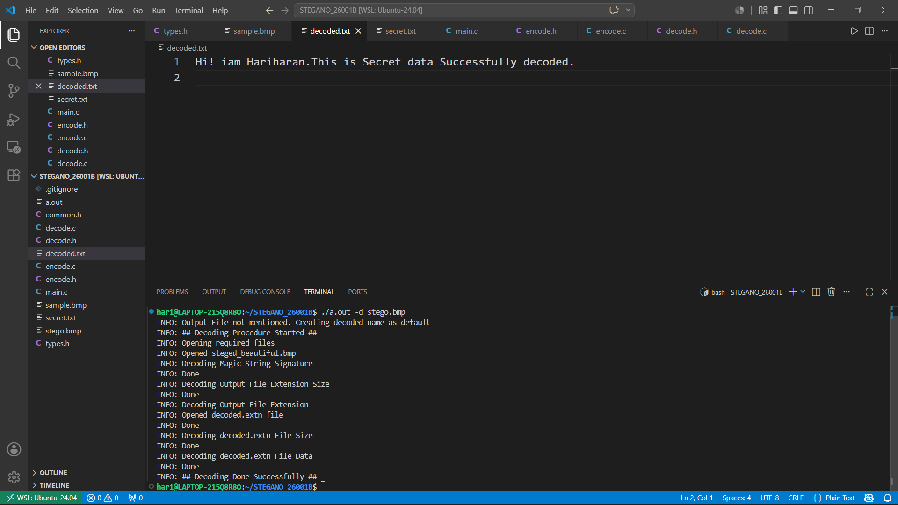
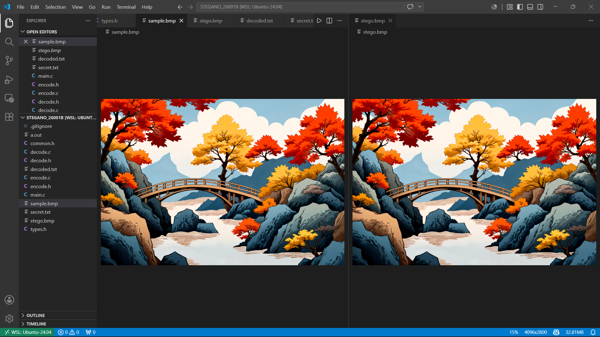

# 🖼️ LSB Image Steganography System (C)


[](LICENSE)

---

## 📌 Overview
The LSB Image Steganography System is a command-line software application developed in C to securely hide a secret payload file inside a standard `.bmp` (Bitmap) image. By altering only the microscopic, least significant bits of the image's color bytes, it keeps the payload completely invisible to the human eye, while allowing clean, pixel-perfect extraction and reconstruction later.

---

## 🚀 Features
- 🔒 Secure Data Encoding (Hide payloads into target image assets)
- 🔓 Accurate Data Decoding (Extract hidden blueprints from modified assets)
- 🖼️ Dynamic Header Offset Preservation (Bypasses the header size dynamically using byte 10 map markers)
- 📝 Dynamic Extension Reconstruction (Auto-encodes and resolves string types like `.txt`, `.c`, etc.)
- 💾 Safe Stream Trailing (Preserves untouched original pixels via a safe 4KB block transfer window)
- ⚡ Memory-Safe Pipeline Optimization:
   - Replaced static 1MB allocations with dynamic sizing (`malloc`) matching your file size exactly.
   - Rigorous cleanup using pointers and `free()` boundaries prevents memory leaks.
- 🚫 Corruption Prevention (Full validation testing on command parameters before processing files)

---

## 🛠️ Tech Stack
- **Language:** C  
- **Concepts Used:**
  - Structures & Custom Types
  - Pointers & Dynamic Memory Allocation (`malloc` / `free`)
  - Advanced Bitwise Operations (`>>`, `&`, `|`, `~`)
  - File Streams & I/O Controls (`fopen`, `fread`, `fwrite`, `fseek`, `ftell`)
  - Modular Compilation Frameworks

---

## 📂 Project Structure
```
└── STEGANO_26001B/
├── main.c              → Application gateway & operational dispatcher (entry point)
├── encode.c            → Core encoding engine (capacity checks, data injection trail)
├── encode.h            → Encoding structure maps & prototype declarations
├── decode.c            → Core decoding engine (signature validation, reconstruction stream)
├── decode.h            → Decoding structure maps & prototype declarations
├── common.h            → Global macro configurations (Magic String assignments)
├── types.h             → User-defined program states (Status & Operation enumerations)
├── sample.bmp          → Original carrier source image asset
├── secret.txt          → Hidden text file payload target
├── stego.bmp           → Generated output asset containing hidden data
```
---
## ⚙️ How It Works
1. Identifies the operational mode flag (`-e` for encode / `-d` for decode).
2. Validates user parameters across dynamic checking blocks:
   - Input assets must match target `.bmp` image syntax rules.
   - Content bounds are audited to guarantee the carrier image can hold the secret payload.
3. Steps completely past the dynamic BMP header block to safeguard structural metadata.
4. Executes sequential bitwise encoding array iterations:
   - Embeds a unique 2-byte Magic String block identifier signature.
   - Embeds the secret file extension dimensions followed by its text characters.
   - Injects raw payload data directly across target bit paths.
5. Replicates the remainder of the carrier trail seamlessly into the output file.
   
---

## 🔐 Validation & Safety Highlights

- **Strict Command-Line Argument Verification:**
  - **Encoding Mode:** Enforces a rigid structure demanding exactly **4 or 5 arguments** (`./stego -e source.bmp secret.txt [output.bmp]`). Anything else triggers an immediate warning block.
  - **Decoding Mode:** Enforces a strict structure demanding exactly **3 or 4 arguments** (`./stego -d stego.bmp [output_name]`). Prevents missing or floating parameters.
- **Carrier & Payload File System Guards:**
  - **Format Consistency Verification:** Validates that input images and specified output filenames match the `.bmp` file format rules explicitly before processing.
  - **Dynamic Capacity Calculation:** Automatically parses the source image width and height to calculate total pixel byte capacity. It runs a mathematical boundary check to confirm the image is large enough to safely hold the magic string, extension metrics, and payload data combined before modifying a single byte.
  - **Empty File Interception:** Checks the secret text payload sizing using stream operations. If the target file is empty, the pipeline blocks execution to avoid injecting null data trails.
- **Robust Error & Memory Handling:**
  - **Dynamic Remote Mirror Memory Safeguards:** Employs explicit boundary pointers during file reading. Memory allocated via `malloc` matches the file byte size down to the single byte (+1 for null termination), instantly freeing resources with `free()` to prevent heap memory leaks.
  - **File Stream Access Interception:** Wraps all file-opening commands in diagnostic error catch blocks (`perror`). If a file is missing, corrupt, or locked out of permissions, the program prints a safe execution warning and halts instantly rather than throwing a core segmentation fault.
  - **Magic String Signature Validation:** During decoding, it extracts and evaluates the 2-byte signature. If the code elements don't match your unique tracking sequence perfectly, it catches the mismatch instantly, flags the image as invalid, and prevents corrupted extraction files from polluting your directory.
## 🧠 Key Learnings
- **Modular Multi-File Code Architecture:** Developed clean, decoupled project files linking custom structural layers and headers together.
- **Advanced Low-Level Data Manipulation:** Mastered binary injection mechanics using custom logic bitwise masking and shifting vectors (`&`, `|`, `~`, `>>`).
- **File System Positioning Frameworks:** Implemented file byte navigation pipelines using pointer offset operations (`fseek`, `ftell`, `rewind`).
- **Heap Memory Management Migration:** Transitioned the core storage footprint from static stack layout barriers directly to flexible runtime `malloc` and `free` routines.
- **Binary Stream State Validation:** Engineered diagnostic logging checkpoints to trace hex signatures and prevent bit stream misalignment crashes.

---
## 📸 Screenshots

### Main()


### Encoding Stage:


### Decoding Stage:


### Sample and Encode images:


---

## 📈 Future Enhancements
- **Expanded Asset Parsing Pipelines:** Scale file readers to support alternate graphic matrix standards such as `.png` and `.ppm` formats.

---

## 🙌 Author
**Hariharan R**  
🎓 2025 Graduate | Electronics and Communication Engineering  
🔧 Aspiring Embedded Systems Engineer  
💻 Strong in C Programming, Problem Solving & Input Validation Logic  
⚙️ Interested in Embedded Systems, Microcontrollers & Low-Level Development  

---

## 🌟 Support
If you like this project:

⭐ Star this repository  
🍴 Fork and improve it   
📢 Share with others   

---

## 📬 Contact

- 📧 Email: hariharanrbe@gmail.com
- 💼 LinkedIn: https://www.linkedin.com/in/hariharanrbe/

---

## 🏷️ Tags
`C Programming` `File Handling` `Bitwise Operations` `Steganography` `Low-Level Development` `Security` `Memory Management` `Binary Data Parsing`
